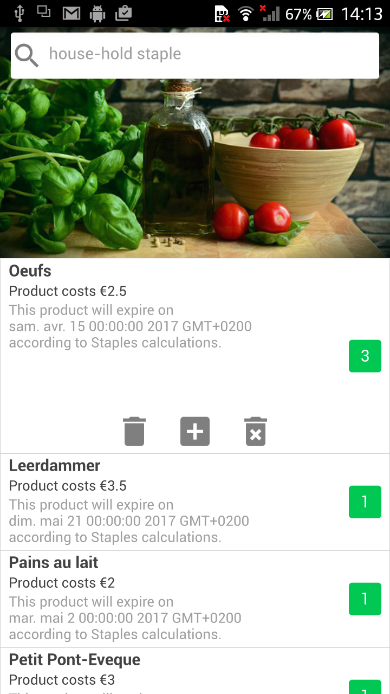

# Staples

  
  

 
Gather all your house-hold staples on a single platform !

# Versions

**v1.0** Release for Home Testing (RH 1.0 version)
**v1.0** Release brings the basic features :
* List of staples with their names
* Product price
* Product expriration date
* Product numbers
* Indicator stocks
* Wallpaper for staples
Staples is modern application that sync with a database
to retrieve your house-hold staples, and display the result
in a beautifully screen.

# How to install ?

To install Staples, jump to **[releases](https://github.com/kounkou/Staples/releases)**,
and download the APK file on your device.
From then, following the instructions to install the application on your device.
Please note, Staples in currently shipped in 'Debug' mode, so, you will
need to accept installing unknown sources on your device.

# How to test with your personal database [ Developer ]

Staples application can be tested on your personal server for Staples
1. You will first need to install as described in - How to install -.
2. Once you have installed Staples application, you will need to fork Staples project from **[github](https://github.com/kounkou/Staples)**
3. You will need to launch the server application as **root**

`# bash weberser.sh`

4. please Enjoy !

# Contact

Please contact, me or my collaborators at
conact 1 : gkounkou@gmail.com
